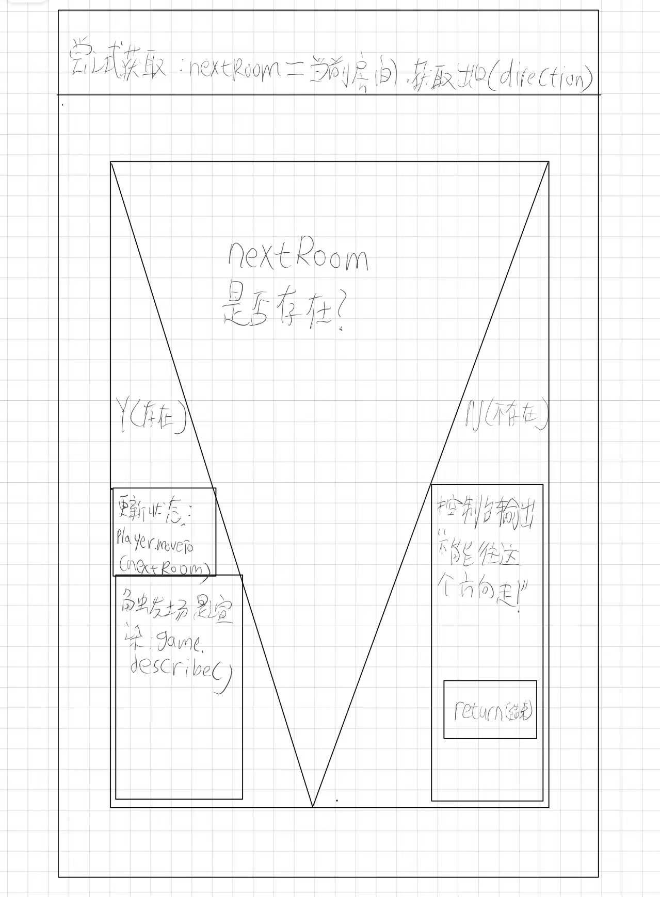

| 方法签名 (Method Signature) | 可见性 (Visibility) | 参数说明 (Parameters) | 返回值 (Return) | 核心职责描述 (Description) |
| :--- | :--- | :--- | :--- | :--- |
| `handleInput(input: String)` | Public (公开) | `input`: 终端截获的原始玩家输入字符串 | `ResultObject` (包含是否退出标识) | **主控中枢：** 接收外界脏数据，调度命令解析器进行分发。 |
| `move(direction: String)` | Public (公开) | `direction`: 标准化后的方向指令 (如 north) | `void` | **空间逻辑：** 校验目标连通性，更新玩家坐标实体并触发场景重绘。 |
| `describe()` | Public (公开) | 无参数 | `void` | **表现渲染：** 获取当前房间描述与可用出口，推送至 UI/控制台输出缓冲。 |
| `checkGameState()` | Private (私有) | 无参数 | `boolean` | **内部自检：** 每次操作后校验游戏循环是否应当继续（如玩家死亡则置 false）。 |

